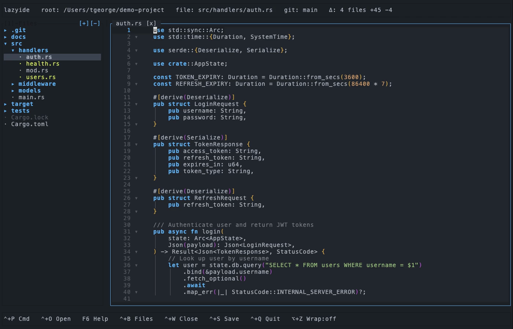

# lazyide

[](https://github.com/TysonLabs/lazyide/releases)
[](LICENSE)
[](https://github.com/TysonLabs/lazyide/actions)


A lightweight terminal IDE built with Rust and [ratatui](https://ratatui.rs). File tree, tabbed editing, LSP, syntax highlighting, code folding, git integration, project search, 32 themes, and customizable keybindings — all in a single binary.

A full IDE experience anywhere you have a terminal. SSH into a server, run `lazyide`, and pair with your agentic coding tool.


<details>
<summary>Static screenshot</summary>



</details>

## Install

**Linux / macOS / WSL2:**
```bash
curl -fsSL https://tysonlabs.dev/lazyide/install.sh | sh
```

**Windows (PowerShell):**
```powershell
irm https://tysonlabs.dev/lazyide/install.ps1 | iex
```

<details>
<summary>More install options</summary>

**Homebrew (macOS):**
```bash
brew tap TysonLabs/tap && brew install lazyide
```

**Scoop (Windows):**
```powershell
scoop bucket add lazyide https://github.com/TysonLabs/scoop-bucket
scoop install lazyide
```

**From source:**
```bash
cargo install --git https://github.com/TysonLabs/lazyide
```

**Prebuilt binaries:** [GitHub Releases](https://github.com/TysonLabs/lazyide/releases)

**Installer flags:**
```bash
sh install.sh --with-deps          # also install ripgrep + rust-analyzer
sh install.sh --prefix /usr/local/bin
sh install.sh --version v0.3.0
```

</details>

After installing, run `lazyide --setup` to detect and install optional tools (rust-analyzer, ripgrep).

## Features

### Editor
- **LSP integration** — rust-analyzer completions with inline ghost text, diagnostics, go-to-definition
- **Syntax highlighting** — Rust, Python, JS/TS, Go, PHP, CSS/SCSS, HTML/XML, Shell, JSON/TOML/YAML, Markdown
- **Code folding** — brace-based (Rust, JS, Go), indentation-based (Python), tag-based (HTML/XML)
- **Bracket pair colorization** — `{}` `()` `[]` colored by nesting depth
- **Find & replace** — regex search in file, ripgrep-powered project search
- **Word wrap** — toggle with `Alt+Z`, with full cursor/selection/mouse support
- **Horizontal scrolling** — `Shift+scroll` when word wrap is off

### Git
- **Gutter markers** — added `+`, modified `~`, deleted `-` per line via `git diff`
- **File status** — tree colors files by status (modified, added, untracked) with directory propagation
- **Branch display** — branch name and change summary in the top bar

### Interface
- **32 themes** — dark and light, with live preview browser
- **Customizable keybindings** — remap ~40 actions via config file or in-app editor
- **Tabbed editing** — preview tabs, sticky tabs, dirty indicators
- **File tree** — folders-first sorting, expand/collapse, context menus, resizable divider
- **Command palette** — `Ctrl+P` for quick access to all actions
- **Autosave & recovery** — buffers saved every 2s, crash recovery on reopen

## Keyboard

<details>
<summary>Global</summary>

| Key | Action |
|-----|--------|
| `Ctrl+P` | Command palette |
| `Ctrl+O` | Quick open (fuzzy search) |
| `Ctrl+S` | Save |
| `Ctrl+W` | Close tab |
| `Ctrl+Q` | Quit (press twice if unsaved) |
| `Ctrl+B` | Toggle file tree |
| `Ctrl+F` | Find in file |
| `Ctrl+H` | Find and replace |
| `Ctrl+Shift+F` | Search project (ripgrep) |
| `Ctrl+N` | New file |
| `Ctrl+R` | Refresh tree |
| `Alt+Z` | Toggle word wrap |
| `F1` / `F2` | Previous / next tab |
| `F4` | Help |
| `Tab` / `Shift+Tab` | Focus tree / editor |

</details>

<details>
<summary>Editor</summary>

| Key | Action |
|-----|--------|
| `Ctrl+Space` | LSP completion |
| `Ctrl+D` | Go to definition |
| `Ctrl+G` | Go to line |
| `Ctrl+J` | Toggle fold |
| `Ctrl+U` | Toggle fold all |
| `Ctrl+Z` / `Ctrl+Y` | Undo / redo |
| `Ctrl+/` | Toggle comment |
| `Ctrl+C` / `Ctrl+X` / `Ctrl+V` | Copy / cut / paste |
| `Ctrl+A` | Select all |
| `Shift+Alt+Down` / `Up` | Duplicate line |
| `F3` / `Shift+F3` | Find next / previous |
| `PageUp` / `PageDown` | Scroll page |
| `Ctrl+Home` / `Ctrl+End` | Start / end of file |

</details>

<details>
<summary>Tree</summary>

| Key | Action |
|-----|--------|
| `Up` / `Down` / `K` / `J` | Navigate |
| `Right` / `L` / `Enter` | Open / expand |
| `Left` / `H` | Collapse / parent |
| `Delete` | Delete (with confirmation) |

</details>

<details>
<summary>Mouse</summary>

- Click file/folder in tree to open
- Drag divider to resize panes
- Right-click tree for context menu (New File, Rename, Delete)
- Click + drag in editor to select text
- Right-click editor for edit menu
- Click gutter fold icons to toggle folds
- Shift+scroll to pan horizontally

</details>

<details>
<summary>Custom keybindings</summary>

Override any shortcut in `~/.config/lazyide/keybinds.json`:

```json
{
  "save": "ctrl+s",
  "redo": ["ctrl+shift+z", "ctrl+y"],
  "fold_toggle": "ctrl+j"
}
```

Or use the in-app keybind editor: `Ctrl+P` > "Keybind Editor"

</details>

## Build from source

```bash
cargo build --release
cargo run -- /path/to/project
cargo test
```

Requires Rust 2024 edition.

## Optional tools

| Tool | Purpose | Install |
|------|---------|---------|
| [rust-analyzer](https://rust-analyzer.github.io/manual.html#installation) | LSP completions, diagnostics, go-to-definition | `lazyide --setup` |
| [ripgrep](https://github.com/BurntSushi/ripgrep#installation) | Project-wide search | `lazyide --setup` |
| git | Branch display, gutter markers | System package manager |

## Documentation

- [Architecture](docs/ARCHITECTURE.md) — module structure, data flow, rendering pipeline
- [Contributing](CONTRIBUTING.md) — themes, bug reports, code contributions

## Acknowledgements

- [lazygit](https://github.com/jesseduffield/lazygit) and [lazyssh](https://github.com/Adembc/lazyssh) — inspiration for the terminal-native approach
- [ratatui](https://ratatui.rs) — TUI framework
- [rust-analyzer](https://rust-analyzer.github.io) — LSP server
- [ripgrep](https://github.com/BurntSushi/ripgrep) — project search engine
