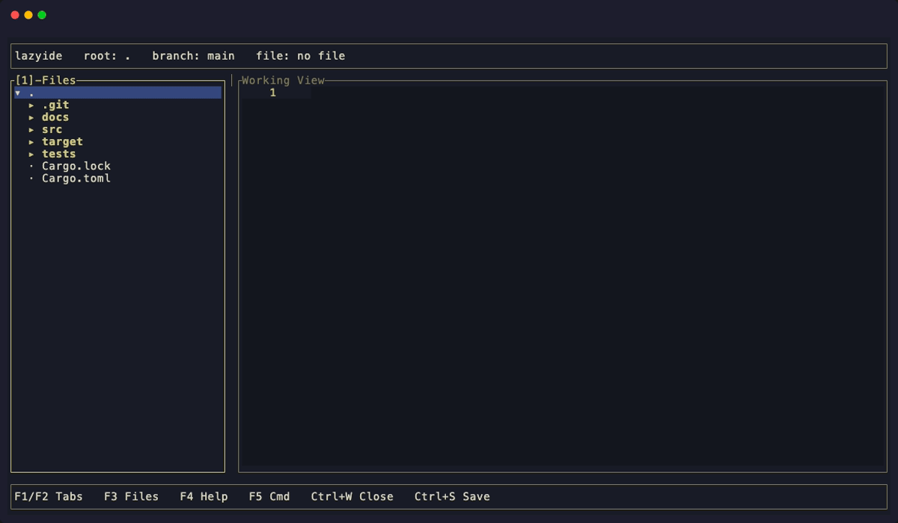

# lazyide

Inspired by [lazygit](https://github.com/jesseduffield/lazygit) and [lazyssh](https://github.com/Adembc/lazyssh) — a lightweight terminal-native IDE built with Rust and [ratatui](https://ratatui.rs). Provides file tree navigation, tabbed editing, LSP integration (rust-analyzer), syntax highlighting, code folding, project search (ripgrep), and a theme system.



## Features

- **LSP** (rust-analyzer): diagnostics in gutter + status bar, completion, go-to-definition
- **Syntax highlighting**: Rust, Python, JS/TS, Go, PHP, CSS/SCSS/SASS, HTML/XML, Shell, JSON/TOML/YAML, Markdown
- **Code folding**: brace-based (Rust, JS, Go), indentation-based (Python), tag-based (HTML/XML)
- **Bracket pair colorization**: `{}`, `()`, `[]` colored by nesting depth (3-color cycle per theme)
- **27 themes**: loaded from `themes/*.json`, with live preview browser (`F5` > Theme). Falls back to built-in dark theme if none found
- **Git branch**: shown in the top bar when inside a git repo
- **Line numbers**: displayed in the editor gutter with diagnostic markers

## Install

**macOS (Homebrew):**
```bash
brew tap tgeorge06/tap
brew install lazyide
```

**Windows (Scoop):**
```powershell
scoop bucket add lazyide https://github.com/tgeorge06/scoop-bucket
scoop install lazyide
```

**From source (all platforms):**
```bash
cargo install --git https://github.com/tgeorge06/lazyide
```
This compiles all dependencies from scratch and may take a few minutes on the first install.

**Prebuilt binaries:** Download from [Releases](https://github.com/tgeorge06/lazyide/releases) for Linux, macOS, and Windows.

## Build & Run

```bash
cargo build --release
cargo run              # run in current directory
cargo run -- /path/to/project  # open a specific project
cargo test             # run tests
```

After building, the binary is at `target/release/lazyide`. Copy it somewhere in your `$PATH` to run it from anywhere:

```bash
cp target/release/lazyide /usr/local/bin/
```

**Requirements:** Rust (2024 edition)

## Setup

After installing, run the setup command to check for optional tools:

```bash
lazyide --setup
```

This detects missing tools (rust-analyzer, ripgrep) and offers to install them automatically.

**Optional external tools** (not installed by cargo, must be installed separately):
- [`rust-analyzer`](https://rust-analyzer.github.io/manual.html#installation) — enables LSP completions, diagnostics, and go-to-definition for Rust files
- [`rg` (ripgrep)](https://github.com/BurntSushi/ripgrep#installation) — enables project-wide search (`Ctrl+Shift+F`)
- `git` — shows current branch name in the top bar

## Keyboard

### Global

- `F1` / `F2` previous / next tab
- `F4` help
- `Ctrl+S` save
- `Ctrl+W` close active tab (with dirty check)
- `Ctrl+Q` quit (two-step if unsaved)
- `Ctrl+B` toggle files pane
- `Ctrl+R` refresh tree
- `Ctrl+N` new file
- `Ctrl+O` quick open file (fuzzy search)
- `Ctrl+P` command palette (also `Ctrl+Shift+P`)
- `Ctrl+F` find in current file (regex)
- `Ctrl+H` find and replace
- `Ctrl+Shift+F` search in project (ripgrep)
- `Tab` focus tree / `Shift+Tab` focus editor

### Editor

- `Ctrl+Space` or `Ctrl+.` LSP completion (ghost suggestion + Tab accept)
- `Ctrl+D` go to definition (Rust LSP)
- `Ctrl+G` go to line
- `Ctrl+J` toggle fold at cursor
- `Ctrl+U` toggle fold all / unfold all
- `Ctrl+Shift+[` / `]` fold / unfold current block
- `Ctrl+Alt+[` / `]` fold all / unfold all
- `F3` / `Shift+F3` find next / previous
- `PageUp` / `PageDown` scroll by page
- `Ctrl+Home` / `Ctrl+End` go to start / end of file
- `Shift+Alt+Down` / `Up` duplicate line
- `Ctrl+Z` undo / `Ctrl+Y` redo
- `Ctrl+A` select all
- `Ctrl+C` copy / `Ctrl+X` cut / `Ctrl+V` paste
- `Ctrl+/` toggle line comment (language-aware)
- `Shift+Arrow` select text
- `Shift+Tab` dedent selected lines

### Tabs

- **Single-click** file in tree: open as preview tab (italic, replaced by next click)
- **Double-click** or **Enter** in tree: open as sticky tab (permanent)
- **Editing** a preview tab auto-promotes it to sticky
- Click tab name to switch, click `[x]` to close
- Dirty tabs show `*` prefix

### Tree

- `Up/Down` or `K/J` move
- `Left` or `H` collapse / go parent
- `Right`, `L`, or `Enter` open/toggle
- `Delete` starts delete confirmation

### Mouse

- Click file/folder in tree to open/toggle
- Drag pane divider to resize (persisted)
- Right-click tree item for context menu (New File, Rename, Delete, etc.)
- Left-click + drag in editor selects text
- Right-click in editor for edit menu (Copy, Cut, Paste, Select All)
- Click fold gutter icons to toggle folds

### Custom Keybindings

All keyboard shortcuts can be remapped via `~/.config/lazyide/keybinds.json`. Only include the keys you want to override — missing actions keep their defaults.

```json
{
  "save": "ctrl+s",
  "redo": ["ctrl+shift+z", "ctrl+y"],
  "fold_toggle": "ctrl+j"
}
```

Values are a single string or array of strings. Keys are snake_case action names (e.g. `save`, `close_tab`, `go_to_definition`, `dup_line_down`).

You can also open the **Keybind Editor** from the command palette (`Ctrl+P` > "Keybind Editor") to browse, remap, and reset keybindings interactively. Conflict detection warns you if a key is already in use.

### Unsaved safety

- `Ctrl+Q` twice to quit with unsaved changes
- Closing a dirty tab prompts: `Enter` save+close, `Esc` discard, `C` cancel

### Autosave & recovery

- Dirty buffers autosave every 2 seconds
- Recovery prompt on reopen if autosave exists
- Conflict prompt if file changes on disk while buffer is dirty: `R` reload, `K` keep local, `D` decide later

## Contributing

Contributions welcome — especially new themes! See [CONTRIBUTING.md](CONTRIBUTING.md) for details.
